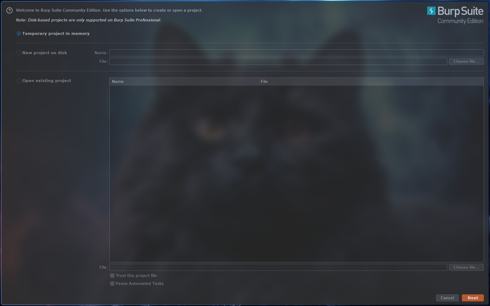
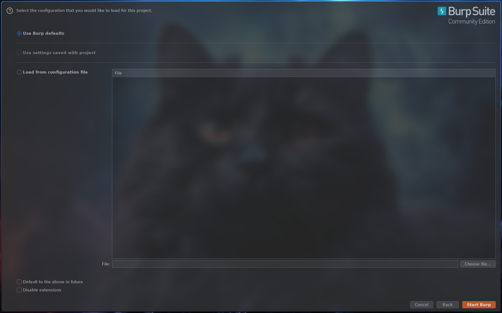
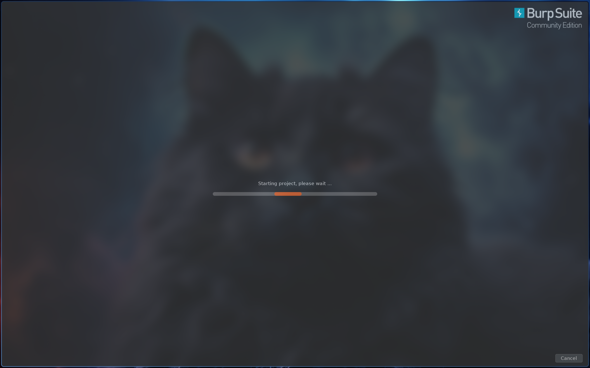
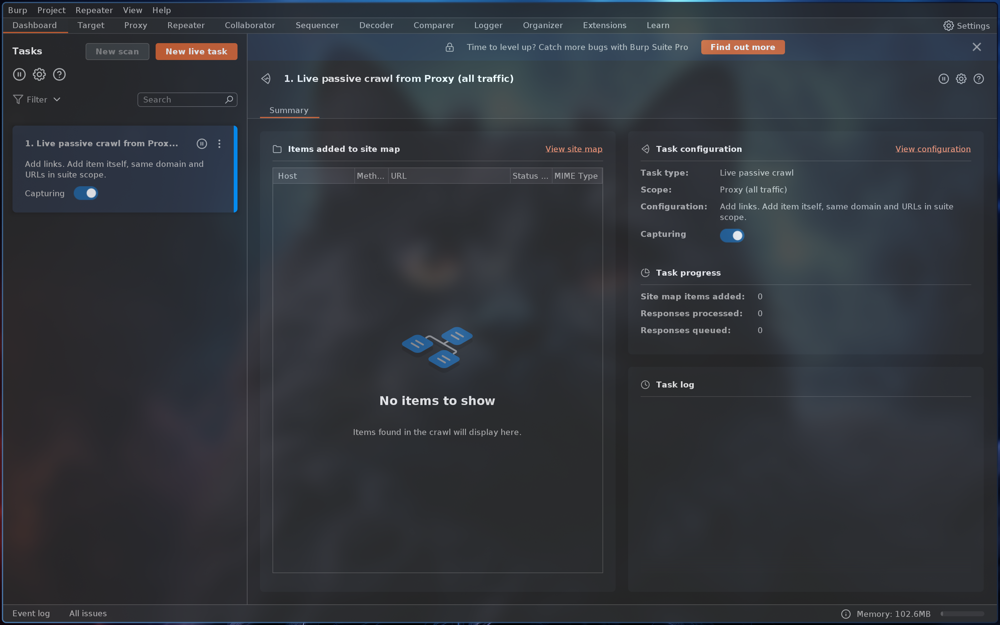
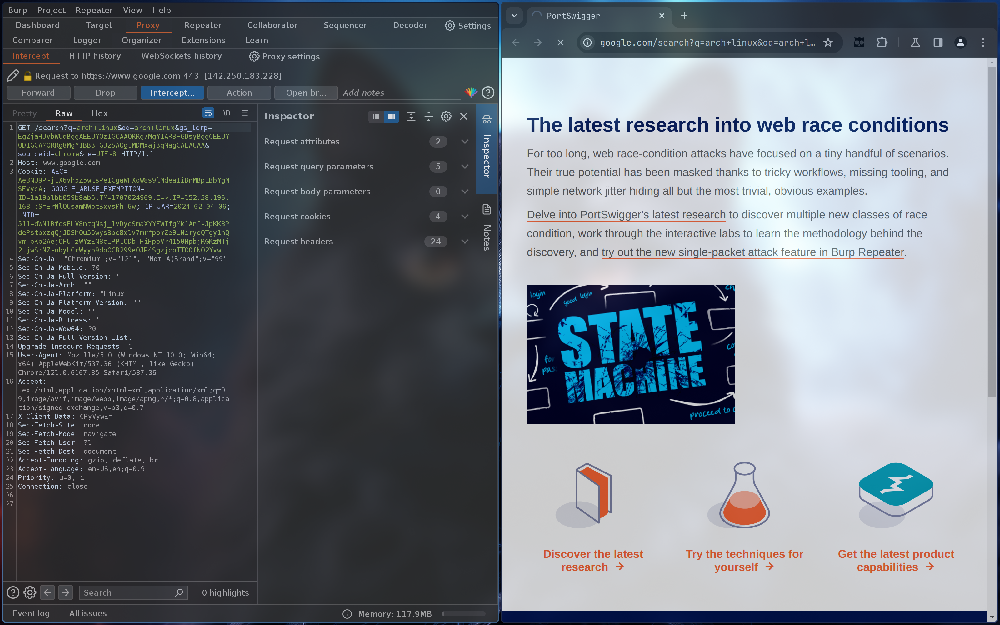
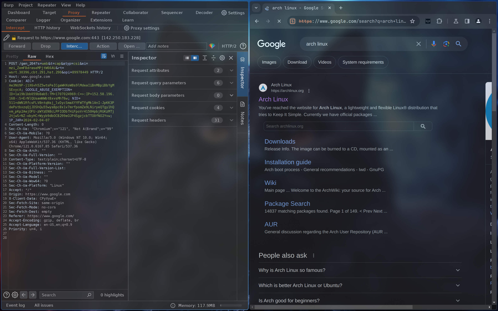
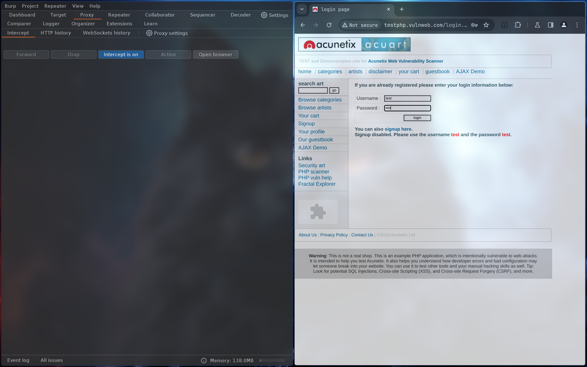
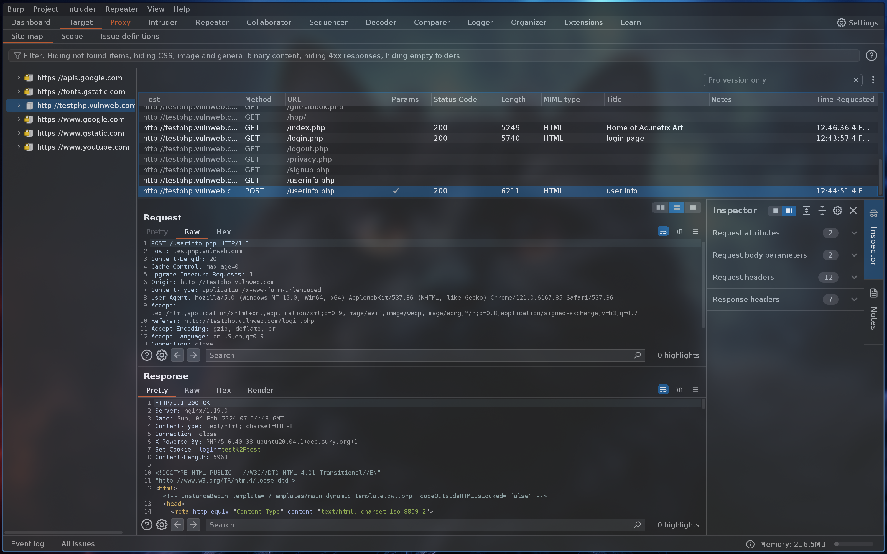

# Burp Suite Lab Experiments


## Installation

1. Install [Burp Suite](https://portswigger.net/burp).
2. Clone this repository:

```
https://github.com/JayaDeep11/Burp-suite.git
```

<p align="center">
    
    
    
    
    
    
    
    
    
    
</p>

